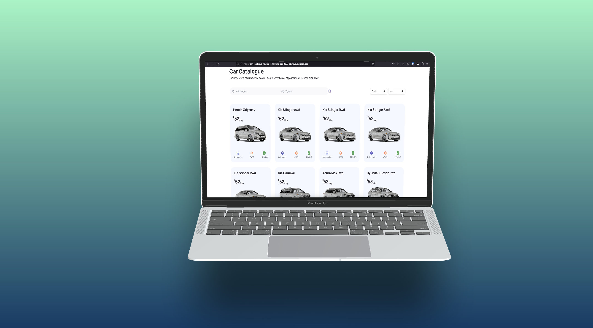

## Build and Deploy Car Catalogue App with React, NextJS, TailwindCSS

Full Stack MERN Next.js 13 NexLink App | React, Next JS, TypeScript

# Technologies
- Next.js 13.4 with Server Side Rendering
- Beautiful layouts with TailwindCSS
- Imagin Studio API to retrieve images
- Headlessui components
- Create reusable components
  
# 🔐 Setup .env file
NEXT_PUBLIC_IMAGIN_API_KEY
NEXT_PUBLIC_RAPID_API_KEY

# Screenshot

